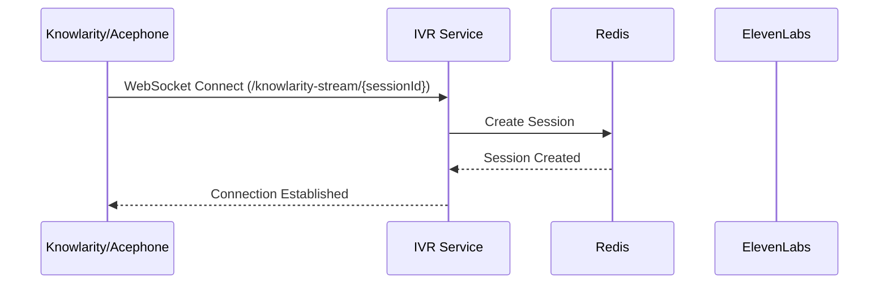
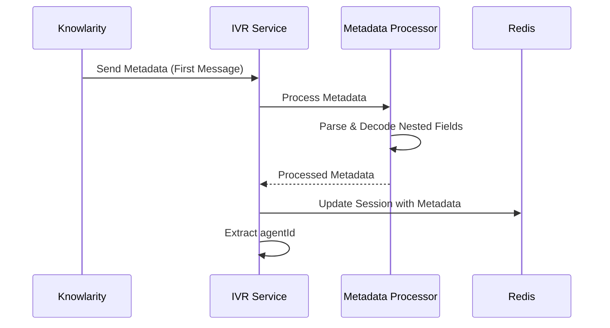
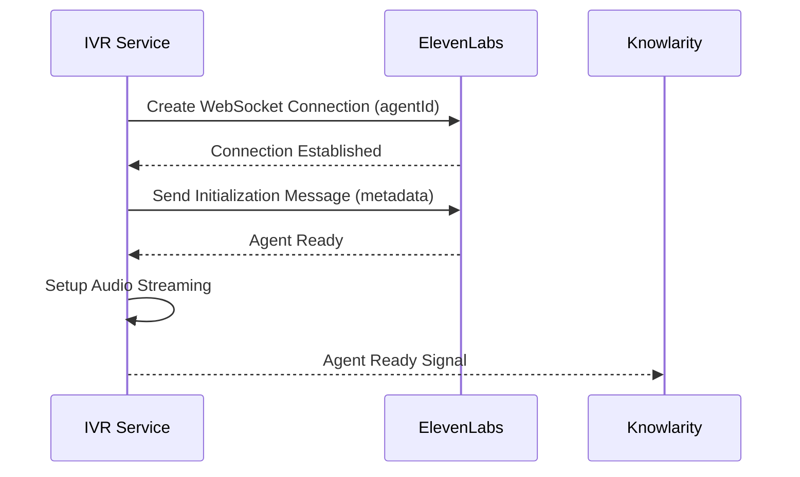
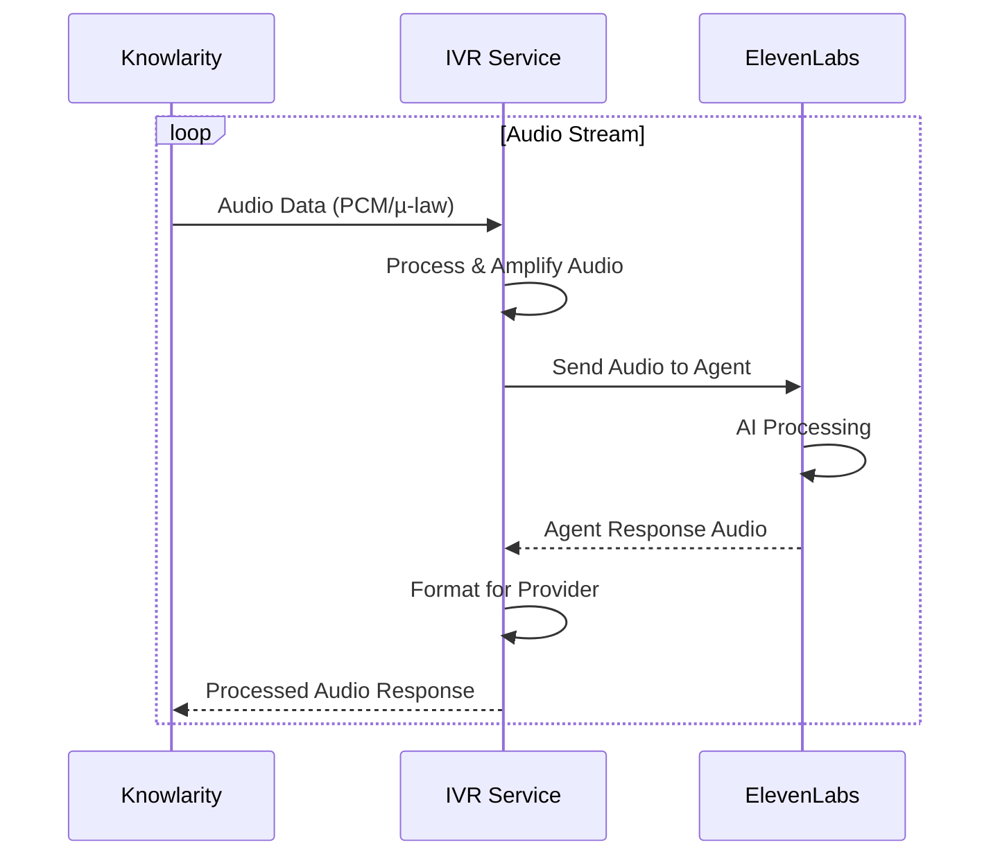
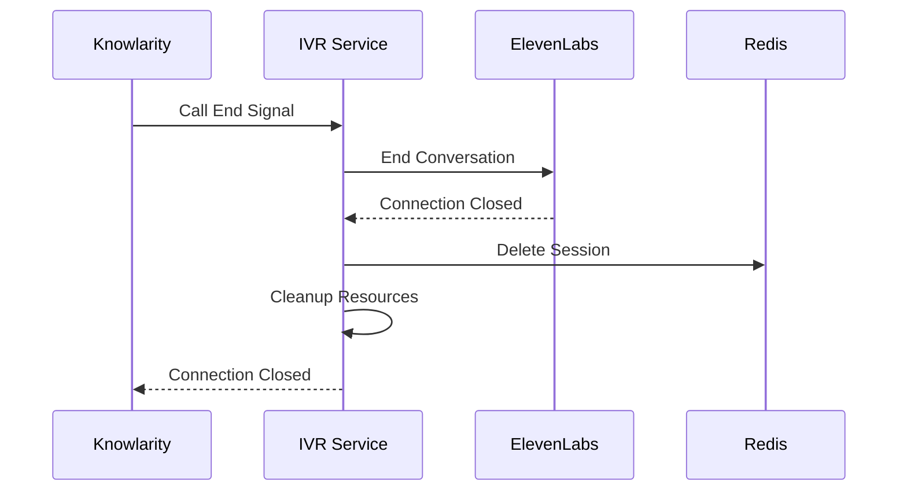
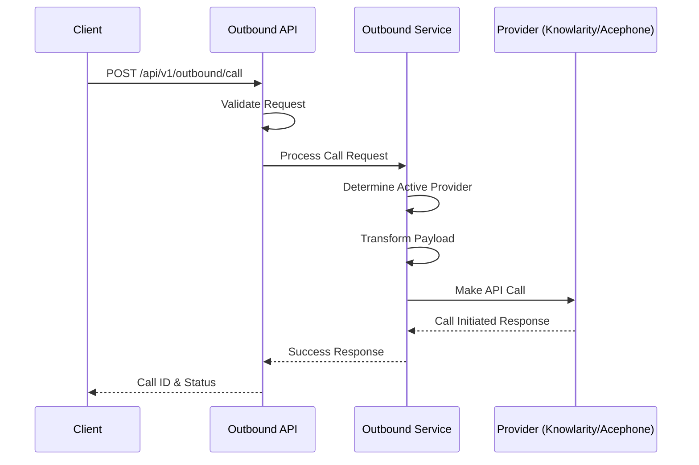

# IVR System Flow Documentation

This document describes the complete flow of the IVR streaming service, covering both inbound and outbound call handling.

## Table of Contents

1. [System Architecture](#system-architecture)
2. [Inbound Call Flow](#inbound-call-flow)
3. [Outbound Call Flow](#outbound-call-flow)
4. [WebSocket Connection Flow](#websocket-connection-flow)
5. [Audio Processing Flow](#audio-processing-flow)
6. [Error Handling Flow](#error-handling-flow)
7. [Provider Integration Flow](#provider-integration-flow)

---

## System Architecture

```
┌─────────────────┐    ┌─────────────────┐    ┌─────────────────┐
│   Knowlarity    │    │   Acephone      │    │   Web Client    │
│   Provider      │    │   Provider      │    │   (Browser)     │
└─────┬───────────┘    └─────┬───────────┘    └─────┬───────────┘
      │                      │                      │
      │ WebSocket            │ WebSocket            │ WebSocket
      │                      │                      │
      └──────────────────────┼──────────────────────┘
                             │
                    ┌────────▼──────────┐
                    │  IVR Service      │
                    │  (Node.js)        │
                    │                   │
                    │  ┌─────────────┐  │
                    │  │ Websocket   │  │
                    │  │ Events      │  │
                    │  │ Handler     │  │
                    │  └─────────────┘  │
                    │                   │
                    │  ┌─────────────┐  │
                    │  │ Session     │  │
                    │  │ Manager     │  │
                    │  └─────────────┘  │
                    │                   │
                    │  ┌─────────────┐  │
                    │  │ Redis Pool  │  │
                    │  │ Manager     │  │
                    │  └─────────────┘  │
                    └────────┬──────────┘
                             │
                    ┌────────▼──────────┐
                    │  ElevenLabs AI    │
                    │  Agent Service    │
                    └───────────────────┘
```

---

## Inbound Call Flow

### 1. Call Initiation


### 2. Metadata Processing


### 3. Agent Initialization


### 4. Audio Streaming Loop


### 5. Call Termination


---

## Outbound Call Flow

### 1. API Request


### 2. Provider Selection & Payload Transformation
```
Input (Standardized):
{
  "customerNumber": "+917972318018",
  "callerNumber": "+918047224660",
  "metadata": { "agentId": "agent_xxx", ... }
}

↓ Provider Detection (Environment Variable)

For Knowlarity:
{
  "ivr_id": "1000129909",
  "k_number": "+919513439773",
  "caller_id": "+918047224660", 
  "customer_number": "+917972318018",
  "is_promotional": "false",
  "metadata": { ... }
}

For Acephone:
{
  "customer_number": "7972318018",  // Cleaned
  "api_key": "xxx",
  "metadata": { ... },
  "async": 1
}
```

---

## WebSocket Connection Flow

### Connection Setup
1. **Route Detection**: URL path determines provider handler
   - `/knowlarity-stream/{sessionId}` → Knowlarity Handler
   - `/acephone` → Acephone Handler

2. **Session Creation**: Store connection in activeConnections Map
3. **Redis Session**: Create persistent session with TTL
4. **Message Handlers**: Setup event listeners for WebSocket events

### Message Processing Flow
```
WebSocket Message Received
         ↓
Is First Message?
         ↓
      YES → Process as Metadata
         ↓
    Parse & Extract agentId
         ↓
    Initialize ElevenLabs Agent
         ↓
    Setup Audio Streaming Bridge
         ↓
      NO → Route as Audio/Control Message
         ↓
    Handle Audio → ElevenLabs
    Handle Control → Call Management
```

---

## Audio Processing Flow

### Inbound Audio (Caller → AI Agent)
```
Caller Audio (Provider Format)
         ↓
    WebSocket Receive
         ↓
    Format Detection (Binary/JSON)
         ↓
    Audio Amplification (2.5x)
         ↓
    Convert to Base64
         ↓
    Send to ElevenLabs Agent
```

### Outbound Audio (AI Agent → Caller)
```
ElevenLabs Agent Response
         ↓
    Base64 PCM Audio (16kHz)
         ↓
    Provider-Specific Conversion:
    
    Knowlarity: PCM → JSON Message
    Acephone: PCM → µ-law → Base64 → Media Event
    Web: PCM → Binary Buffer
         ↓
    Send via WebSocket
```

### Audio Format Conversions
- **Knowlarity**: PCM 16kHz ↔ Raw binary
- **Acephone**: µ-law 8kHz ↔ PCM 16kHz (with upsampling/downsampling)
- **ElevenLabs**: PCM 16kHz Base64

---

## Error Handling Flow

### Validation Errors
```
Request Received
    ↓
Validate Required Fields
    ↓
Missing Fields? → Return 400 with specific error message
    ↓
Invalid Format? → Return 400 with validation error
    ↓
Continue Processing
```

### Provider Errors
```
API Call to Provider
    ↓
Timeout (30s)? → Return TIMEOUT error
    ↓
Rate Limited (429)? → Return RATE_LIMITED error
    ↓
Server Error (5xx)? → Return SERVICE_UNAVAILABLE
    ↓
Success (2xx) → Continue
```

### WebSocket Errors
```
WebSocket Error/Close
    ↓
End ElevenLabs Conversation
    ↓
Update Session Status (failed/terminated)
    ↓
Clean up Redis Session
    ↓
Remove from Active Connections
    ↓
Log Error Details
```

---

## Provider Integration Flow

### Knowlarity Integration
1. **WebSocket**: `/knowlarity-stream/{sessionId}`
2. **Metadata**: JSON with nested URL-encoded fields
3. **Audio**: Raw PCM binary data
4. **Control**: JSON messages (call_start, call_end, dtmf)
5. **Response**: JSON messages with audio content

### Acephone Integration
1. **WebSocket**: `/acephone`
2. **Events**: connected → start → media stream → stop
3. **Audio**: µ-law 8kHz base64 encoded, 160-byte chunks
4. **Metadata**: In start event with customParameters
5. **Response**: Media events with µ-law audio payloads

### ElevenLabs Integration
1. **Connection**: `wss://api.elevenlabs.io/v1/convai/conversation?agent_id={id}`
2. **Initialize**: Send conversation_initiation_client_data
3. **Audio Stream**: Bidirectional PCM 16kHz base64
4. **Dynamic Variables**: Pass metadata as conversation context

---

## Session Management Flow

### Session Lifecycle
```
1. CREATE
   ├─ Generate session ID
   ├─ Store in Redis with TTL (1 hour)
   ├─ Add to activeConnections Map
   └─ Set initial status: "active"

2. UPDATE
   ├─ Receive metadata
   ├─ Update Redis session
   └─ Set status: "active_with_metadata"

3. ACTIVE
   ├─ Audio streaming
   ├─ Periodic health checks
   └─ Connection monitoring

4. CLEANUP
   ├─ WebSocket close/error
   ├─ End ElevenLabs conversation
   ├─ Delete from Redis
   └─ Remove from activeConnections
```

### Redis Database Usage
- **DB 1**: Sessions (session data, TTL)
- **DB 2**: Connections (WebSocket connection info)
- **DB 3**: Cache (temporary data)
- **DB 4**: Locks (distributed locking)

---

## Graceful Shutdown Flow

### Restart Process
```
1. ADMIN REQUEST
   POST /admin/graceful/restart
       ↓
2. CHECK ACTIVE CALLS
   Query Redis for active sessions
       ↓
3. WAIT OR PROCEED
   Active calls? → Wait with timeout
   No calls? → Immediate restart
       ↓
4. NOTIFY CONNECTIONS
   Send shutdown notice to clients
       ↓
5. CLEANUP & EXIT
   Close all connections gracefully
   Exit process (PM2 restarts)
```

### Health Monitoring
- **Connection Health**: WebSocket readyState monitoring
- **Session Validation**: Redis key expiry checks  
- **Provider Status**: API endpoint availability
- **Resource Usage**: Memory, CPU, connection counts

---

## Performance Optimizations

### Connection Pooling
- **Redis Pool**: 2-20 connections per database
- **HTTP Connections**: Keep-alive for provider APIs
- **WebSocket Management**: Efficient connection tracking

### Caching Strategy
- **Session Cache**: Redis with TTL-based expiry
- **Metadata Cache**: Parsed metadata caching
- **Configuration Cache**: Provider settings caching

### Scalability Considerations
- **Horizontal Scaling**: Stateless request handling
- **Load Balancing**: WebSocket session affinity
- **Database Sharding**: Redis database separation
- **Health Checks**: Multi-layer health monitoring

---

This flow documentation provides a comprehensive overview of the IVR system's operation, covering all major components and their interactions.