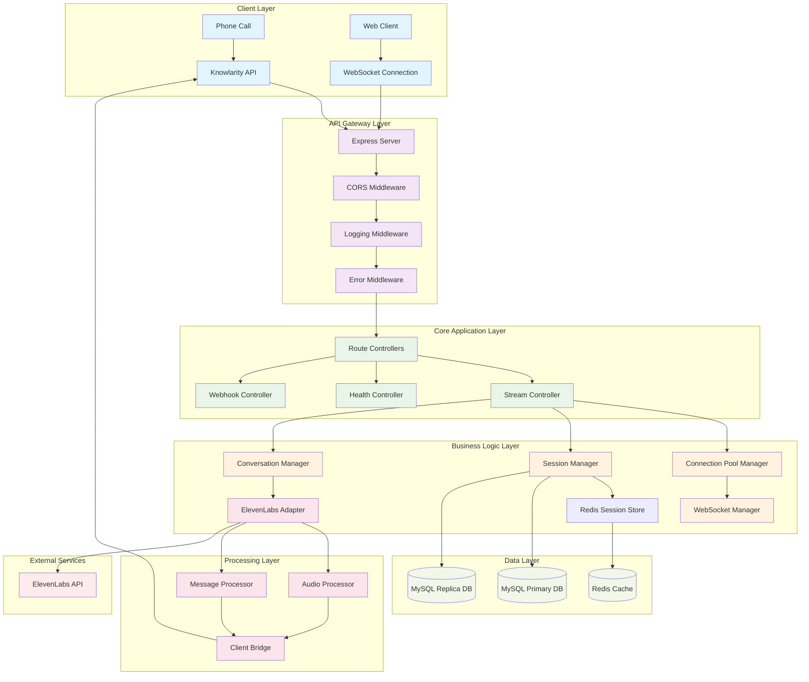

# IVR System Architecture Documentation

## 🏗️ System Overview

This is a production-ready Interactive Voice Response (IVR) system built with Node.js, integrating ElevenLabs Conversational AI for intelligent voice interactions. The system handles real-time audio streaming, session management, and conversation processing with a scalable, microservices-oriented architecture.

## 🎯 Key Features

- **Real-time Voice Processing**: WebSocket-based audio streaming with ElevenLabs AI
- **Scalable Session Management**: Redis-backed distributed session handling
- **Database Integration**: MySQL with read replicas for optimal performance
- **HTTP API Clients**: Axios-based clients with retry logic, interceptors, and error handling
- **Production-Ready**: Comprehensive logging, error handling, and monitoring
- **Modular Architecture**: Clean separation of concerns with organized directory structure

## 📊 Architecture Flow Diagram



## 📁 Directory Structure & Usage

### `/src` - Main Application Source

```
src/
├── app.js                 # Application entry point
├── server.js             # Server initialization
├── constants/            # Application constants
├── config/              # Configuration files
├── core/                # Core business logic
├── controllers/         # Request handlers
├── models/             # Database models
├── routes/             # API route definitions
├── services/           # Business services
├── streaming/          # Real-time processing
├── utils/              # Utility functions
├── middlewares/        # Express middlewares
├── websockets/         # WebSocket handlers
└── security/           # Security configurations
```

### 🔧 `/src/config` - Configuration Management

**Purpose**: Centralized configuration for all system components

- **`cors.js`**: Cross-Origin Resource Sharing settings
- **`streaming.js`**: Real-time streaming configurations  
- **`database/`**: Database connection settings
  - **`dbconfig.js`**: Primary database configuration
  - **`replicadbconfig.js`**: Read replica configuration

**Usage Example**:
```javascript
const config = require('./config/database/dbconfig');
const sequelize = new Sequelize(config.DB.DB, config.DB.USER, config.DB.PASSWORD);
```

### 🎯 `/src/constants` - Application Constants

**Purpose**: Centralized constants for maintainable configuration

**Key Categories**:
- **Connection Pool**: WebSocket connection limits and timeouts
- **Session Manager**: Redis configuration and TTL settings
- **WebSocket**: Connection states and close codes
- **Database**: Table names and operations
- **Errors**: Standardized error codes and HTTP status
- **Logging**: Log levels and categories

**Usage Example**:
```javascript
const { CONNECTION_POOL, DATABASE } = require('../constants');

if (connections.size >= CONNECTION_POOL.MAX_CONNECTIONS) {
    throw new Error('Pool limit exceeded');
}
```

### 🏗️ `/src/core` - Core Business Logic

**Purpose**: Essential business logic and managers

#### `/src/core/managers` - System Managers

- **`connectionPool.js`**: WebSocket connection lifecycle management
  - Features: Connection limits, cleanup, health monitoring
  - Usage: `pool.addConnection(id, websocket, clientInfo)`

- **`sessionManager.js`**: Distributed session management with Redis
  - Features: Session persistence, cross-instance communication
  - Usage: `await sessionManager.createSession(sessionData)`

- **`conversation.js`**: ElevenLabs conversation lifecycle
  - Features: Conversation creation, status tracking
  - Usage: `await createConversation(agentId, sessionId, query)`

- **`websocket.js`**: WebSocket connection to ElevenLabs
  - Features: Real-time communication, message routing
  - Usage: `await sendToElevenLabs(sessionId, message)`

### 🎮 `/src/controllers` - Request Controllers

**Purpose**: Handle HTTP requests and coordinate responses

- **`health.js`**: System health check endpoints
- **`stream.js`**: Streaming session management
- **`webhook.js`**: External webhook handlers

**Usage Pattern**:
```javascript
exports.createSession = async (req, res) => {
    try {
        const session = await sessionManager.createSession(req.body);
        res.json({ success: true, session });
    } catch (error) {
        res.status(500).json({ error: error.message });
    }
};
```

### 🗄️ `/src/models` - Database Models

**Purpose**: Sequelize ORM models for database interactions

- **`index.js`**: Database initialization and model loading
- **`sessions.js`**: IVR session tracking
- **`conversations.js`**: Conversation data and messages
- **`allergies.js`**: Patient allergy information

**Model Pattern**:
```javascript
const { DATABASE } = require("../constants");

module.exports = (sequelize, DataTypes) => {
    return sequelize.define(DATABASE.TABLES.SESSIONS, {
        id: { type: DataTypes.UUID, primaryKey: true },
        sessionId: { type: DataTypes.STRING, allowNull: false }
    });
};
```

### 🛣️ `/src/routes` - API Routes

**Purpose**: RESTful API endpoint definitions

```
routes/
├── index.js          # Main router
└── v1/              # API version 1
    ├── health.js    # Health check routes
    ├── stream.js    # Streaming routes
    └── webhook.js   # Webhook routes
```

### ⚙️ `/src/services` - Business Services

**Purpose**: Reusable business logic services

- **`analytics.js`**: Call analytics and reporting
- **`stream.js`**: Streaming service coordination
- **`apiService.js`**: High-level API operations and business logic

### 🔗 `/src/api` - External API Clients

**Purpose**: Structured axios-based API client architecture

#### `/src/api/baseClient.js` - Base HTTP Client
- **Features**: Request/response interceptors, retry logic, error handling
- **Logging**: Comprehensive request tracing with sanitized headers
- **Retry Strategy**: Exponential backoff with jitter for failed requests

#### `/src/api/clients/` - Specialized API Clients

- **`elevenLabsClient.js`**: ElevenLabs Conversational AI integration
  - Voice synthesis and conversation management
  - WebSocket URL generation for real-time audio
  - Usage tracking and subscription management

- **`knowlarityClient.js`**: Knowlarity telephony platform integration
  - Outbound call management and call logs
  - Phone number configuration and analytics
  - Webhook signature validation

- **`externalClient.js`**: Generic external service client
  - Flexible authentication (API key, Bearer token)
  - File upload/download capabilities
  - Pre-configured Twilio and webhook clients

**Usage Examples**:
```javascript
// Using ElevenLabs client
const { elevenLabsClient } = require('../api');
const conversation = await elevenLabsClient.createConversation(agentId, sessionData);

// Using service layer
const apiService = require('../services/apiService');
const result = await apiService.initializeConversation(agentId, sessionData);

// Using external client factory
const { createWebhookClient } = require('../api');
const webhookClient = createWebhookClient('https://example.com/webhook');
await webhookClient.post('/notify', { message: 'Hello' });
```

### 🔄 `/src/streaming` - Real-time Processing

**Purpose**: Handle real-time audio and message processing

#### `/src/streaming/adapters`
- **`elevenlabs.js`**: Main ElevenLabs API integration

#### `/src/streaming/processors`
- **`audio.js`**: Audio chunk processing and forwarding
- **`message.js`**: Message parsing and routing from ElevenLabs

#### `/src/streaming/bridges`
- **`client.js`**: Bridge between ElevenLabs and calling system

**Processing Flow**:
```
Audio Input → Audio Processor → ElevenLabs → Message Processor → Client Bridge → Output
```

### 🔧 `/src/utils` - Utility Functions

**Purpose**: Reusable utility functions

- **`logger.js`**: Centralized logging with categories
- **`errors.js`**: Custom error classes and handlers

**Logger Usage**:
```javascript
const Logger = require('../utils/logger');
Logger.info('Session created', { sessionId, clientType });
Logger.error('Connection failed', error);
```

### 🛡️ `/src/middlewares` - Express Middlewares

**Purpose**: Request/response processing middlewares

- **`error.js`**: Global error handling
- **`logging.js`**: Request logging and monitoring

### 🌐 `/src/websockets` - WebSocket Handlers

**Purpose**: WebSocket event handling and namespacing

```
websockets/
├── events/          # WebSocket event handlers
├── middleware/      # WebSocket middlewares
└── namespaces/      # Socket.io namespaces
```

## 🔌 External Integrations

### ElevenLabs Conversational AI
- **Purpose**: AI-powered voice conversations
- **Protocol**: WebSocket for real-time audio streaming
- **Features**: Speech-to-text, text-to-speech, conversation flow

### Redis Cache
- **Purpose**: Distributed session storage and pub/sub
- **Features**: Session persistence, cross-instance communication
- **Configuration**: `SESSION_MANAGER.REDIS_CONFIG`

### MySQL Database
- **Purpose**: Persistent data storage
- **Architecture**: Primary-replica setup for read/write optimization
- **Models**: Sessions, conversations, patients, medical data

## 🚀 Getting Started

### Prerequisites
- Node.js 18+
- Redis Server
- MySQL 8.0+
- ElevenLabs API Key

### Installation

```bash
# Install dependencies
npm install

# Set up Redis (macOS)
brew install redis
brew services start redis

# Configure database
# Update src/config/database/dbconfig.js with your settings

# Start the application
npm start
```

### Environment Setup

The application uses hardcoded configurations in config files. Update the following files for your environment:

- `src/config/database/dbconfig.js` - Primary database settings
- `src/config/database/replicadbconfig.js` - Replica database settings
- Set `ELEVENLABS_API_KEY` environment variable

### API Endpoints

#### Health Check
```http
GET /api/v1/health
```

#### Create Streaming Session
```http
POST /api/v1/stream/session
Content-Type: application/json

{
    "agentId": "your-agent-id",
    "patientQuery": "Patient information",
    "phoneNumber": "+1234567890"
}
```

#### WebSocket Connection
```javascript
const ws = new WebSocket('ws://localhost:3000');
ws.on('message', (data) => {
    // Handle real-time audio/text data
});
```

## 📈 Monitoring & Observability

### Health Checks
- **Database**: Connection status for primary and replica
- **Redis**: Cache connectivity and performance
- **Connection Pool**: Active connections and utilization
- **External APIs**: ElevenLabs API availability

### Logging Categories
- **Connection**: WebSocket connection events
- **Session**: Session lifecycle tracking
- **Conversation**: AI conversation processing
- **Performance**: Response times and throughput
- **Security**: Authentication and authorization events

### Metrics
- Connection pool utilization
- Session duration and success rates
- Database query performance
- API response times

## 🏭 Production Considerations

### Scalability
- **Horizontal Scaling**: Multiple Node.js instances with Redis session sharing
- **Database**: Read replicas for query optimization
- **Connection Pooling**: Configurable limits and cleanup

### Security
- **CORS**: Configurable origin restrictions
- **Rate Limiting**: Request throttling
- **Input Validation**: Structured data validation
- **Error Handling**: Secure error messages

### Performance
- **Connection Reuse**: WebSocket connection pooling
- **Database Optimization**: Indexed queries and prepared statements
- **Memory Management**: Automatic cleanup of expired sessions
- **Caching**: Redis for frequently accessed data

## 🔧 Database Schema

### Tables Overview

#### Sessions Table
- **Purpose**: Track IVR session lifecycle
- **Fields**: sessionId, patientId, agentId, status, duration, metadata
- **Indexes**: sessionId, patientId, status, startTime

#### Conversations Table  
- **Purpose**: Store conversation data and messages
- **Fields**: conversationId, sessionId, agentId, messages, summary, sentiment
- **Indexes**: conversationId, sessionId, status, agentId

#### Allergies Table
- **Purpose**: Patient allergy information
- **Fields**: allergyName, severity, patientId, notes, isActive
- **Indexes**: patientId, allergyName, severity

### Database Configuration

```javascript
// Primary Database (Write Operations)
const config = {
    HOST: "hexahealth-db.cqnt4cbjitmj.ap-south-1.rds.amazonaws.com",
    USER: "preproduser", 
    PASSWORD: "hexa@mysql",
    DB: "new_dev_db",
    dialect: "mysql"
};

// Replica Database (Read Operations)
const replicaConfig = {
    HOST: "hexahealth-replica-db.cqnt4cbjitmj.ap-south-1.rds.amazonaws.com",
    // ... same credentials
};
```

## 🤝 Contributing

1. Follow the established directory structure
2. Use constants from `/src/constants` for configuration
3. Implement proper error handling with standard error codes
4. Add comprehensive logging for debugging
5. Write unit tests for new features
6. Update this documentation for architectural changes


************************************************************************************************
 📞 Complete Call Flow: Knowlarity → Your IVR System
************************************************************************************************


  🔄 Redis Database Usage:

  Redis Database Separation:

  - DB 1 (SESSIONS): User sessions, conversation data, session metadata
  - DB 2 (CONNECTIONS): WebSocket connection tracking, connection pool state
  - DB 3 (CACHE): Temporary data, performance optimization
  - DB 4 (LOCKS): Distributed locks for concurrent operations

  📋 Step-by-Step Call Flow:

  1. 📞 Call Initiated

  Caller dials → Knowlarity receives → WebSocket connects to /knowlarity-stream/{sessionId}

  2. 🌐 WebSocket Connection (stream.js:31-67)

  handleConnection(websocket, request) →
  handleKnowlarityStream(websocket, urlPath) →
  sessionId = urlPath.split("/")[2] // Extract session ID from URL

  3. 💾 Session Storage (Redis DB 1)

  // Store connection info
  activeConnections.set(sessionId, {
    websocket,
    clientType: "knowlarity",
    connectedAt: new Date(),
    agentConversation: null
  });

  4. 📨 First Message: Metadata Processing

  // First message contains call metadata
  isFirstMessage = true;
  metadata = parseKnowlarityMetadata(incomingMessage);
  // Contains: callid, virtual_number, customer_number, agentId, treatmentType

  5. 🤖 ElevenLabs Agent Initialization

  initializeAgentConversationAfterMetaData(sessionId, metadata) →
  elevenLabsAgentService.createConversation(agentId, sessionId, {treatmentType}) →
  // Creates WebSocket to ElevenLabs API

  6. 🔄 Session Management (Redis DB 1)

  SessionManager.createSession({
    sessionId: sessionId,
    clientInfo: {type: "knowlarity"},
    metadata: {agentId, treatmentType}
  });

  // Stored in Redis DB 1 with TTL
  redisPool.execute(async (redis) => {
    await redis.setex(
      `ivr:session:${sessionId}`,
      3600, // 1 hour TTL
      JSON.stringify(session)
    );
  }, REDIS_POOL.DATABASES.SESSIONS); // DB 1

  7. 🎵 Audio Streaming Setup

  setupAudioStreaming(sessionId) →
  setClientMessageHandler((sessionId, agentMessage) => {
    // Registers callback for ElevenLabs responses
  });

  8. 🎤 Real-time Audio Flow

  Incoming Audio (Caller → AI):

  Caller speaks → Knowlarity → Binary PCM →
  handleIncomingAudio() → amplifyAudioVolume(2.5x) →
  Base64 encode → sendAudioToAgent() → ElevenLabs

  Outgoing Audio (AI → Caller):

  ElevenLabs processes → agent_audio event → 
  setClientMessageHandler callback → 
  JSON.stringify({type: "playAudio", data: {audioContent}}) → 
  Knowlarity → Caller hears response

  9. 💬 Conversation Tracking (Redis DB 1)

  conversationManager.createConversation(agentId, sessionId, patientQuery);
  // Stored in Redis with conversation messages, status, sentiment

  10. 📊 Connection Pool Monitoring (Redis DB 2)

  // WebSocket connection state tracked in Redis DB 2
  redisPool.execute(async (redis) => {
    await redis.hset(`ivr:connection:${sessionId}`, {
      status: 'connected',
      lastActivity: Date.now(),
      clientType: 'knowlarity'
    });
  }, REDIS_POOL.DATABASES.CONNECTIONS); // DB 2

  11. 🔒 Distributed Locking (Redis DB 4)

  // For concurrent operations, session locks stored in DB 4
  await sessionManager.acquireLock(sessionId, 30000); // 30 second TTL
  redisPool.execute(async (redis) => {
    return await redis.set(lockKey, lockValue, 'PX', 30000, 'NX');
  }, REDIS_POOL.DATABASES.LOCKS); // DB 4

  12. 📞 Call End Process

  // When call ends
  handleConversationEnd(sessionId) →
  conversationManager.endConversation(sessionId) →
  // Cleanup from Redis DB 1
  redisPool.execute(async (redis) => {
    await redis.del(`ivr:session:${sessionId}`);
  }, REDIS_POOL.DATABASES.SESSIONS);

  // Close WebSocket connections
  websocket.close(1000, "Call completed");
  activeConnections.delete(sessionId);

  🎯 Key Redis Operations During Calls:

  High-Frequency Operations (DB 1):

  - Session state updates every few seconds
  - Conversation message logging
  - Session activity heartbeats

  Medium-Frequency Operations (DB 2):

  - Connection health checks every 30 seconds
  - WebSocket state tracking

  Low-Frequency Operations (DB 3 & 4):

  - Caching agent responses for performance
  - Distributed locks for critical operations

  📈 Performance Benefits:

  - Connection Pooling: Up to 20 concurrent Redis operations
  - Database Separation: Prevents cross-contamination of data types
  - Automatic Cleanup: TTL on sessions (1 hour), connections (5 minutes)
  - Health Monitoring: 30-second intervals ensure connection reliability

  Your Redis connection pool efficiently manages all call states across 4 specialized databases during live voice conversations! 🎉